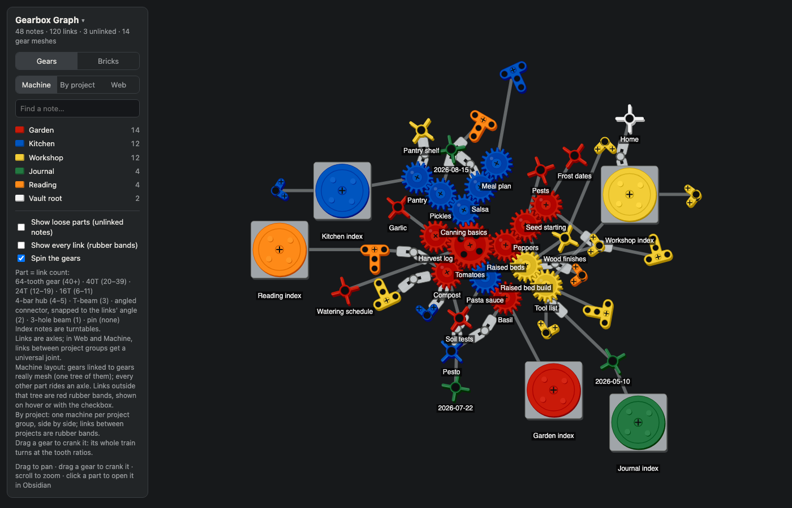

# gearbox-graph

Your Obsidian vault as a machine of meshing gears. Grab a gear and crank it, and every gear in its train turns at the right tooth ratio.



*The screenshot shows the fictional vault in `demo-vault/`.*

- **Gears:** each note becomes a part, sized by how many links it has. The best-connected notes become 64-, 40-, 24- and 16-tooth gears; lightly linked notes become beams, connectors, hubs and pins; index notes become turntables.
  - Gears linked to gears really mesh: the centre distance is the sum of the pitch radii, and the teeth sit in each other's gaps.
  - Links are axles. Links between groups get a universal joint.
  - Links that don't fit the gear train become rubber bands, shown on hover.
- **Bricks:** the same vault as plain bricks, where brick size is the link count.
- **Layouts:**
  - *Machine*: the whole vault as one build.
  - *By project*: one machine per group.
  - *Web*: a classic force-directed graph.
- Search, toggle groups, and click any part to open that note in Obsidian.

## It stays on your computer
- **No network, ever.** The builder makes no connections, and the page it writes loads nothing from the internet: no fonts, no scripts, no analytics.
- **Read-only on your vault.** It only opens `.md` files for reading. It writes two files, both next to the launcher: `gearbox-graph.html` and `.vault-path` (the folder you picked).
- **No install.** It needs Python 3.9 or newer and a web browser, and nothing else.

## Quick start

**Mac:** double-click `gearbox-graph.command`. The first time, drag your vault folder into the window and press Return. After that, one double-click rebuilds the graph and opens it.

**Windows:** double-click `gearbox-graph.bat`. The first time, paste your vault's folder path. After that, one double-click rebuilds the graph and opens it.

To switch vaults, delete `.vault-path` (a hidden file on Mac) and run it again.

**Any system, from a terminal:**
```bash
python3 gearbox_graph.py --vault /path/to/your/vault
```
Then open `gearbox-graph.html`. Options:
- `--out FILE` writes somewhere else.
- `--config groups.json` sets your own groups and colors.
- `--vault-name NAME` sets the vault name, if Obsidian's name for the vault isn't its folder name. Clicking a part uses it to open the note.

**If your computer blocks the launcher:** scripts downloaded from the internet sometimes get stopped the first time.
- On Mac, allow it under System Settings → Privacy & Security.
- On Windows, SmartScreen offers a "More info → Run anyway" link.
- Or skip the launcher and use the terminal command above.

**Shortcut icon (optional):** `icons/` has a brick icon, `.png` for Mac and `.ico` for Windows.

## Colors
By default each top-level folder gets its own color, biggest folder first. Notes at the vault root are white.

To group things your own way, copy `groups.example.json`, edit it, and pass it with `--config`.
- `folders` maps top-level folders to groups.
- `tags` maps a note's `project:` frontmatter value to a group, and wins over the folder.
- `folders_win` lists folders whose notes ignore tags.
- Anything unmatched goes to `fallback`.

## Tests
```bash
python3 -m unittest discover tests
```

## License
MIT. See [LICENSE](LICENSE).
